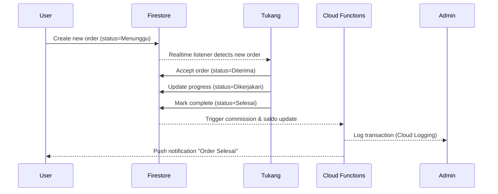
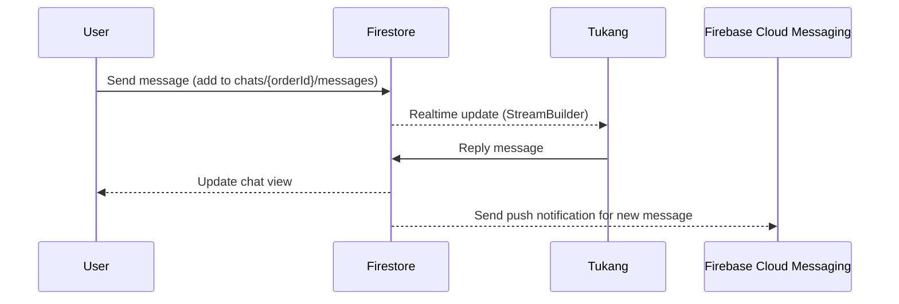
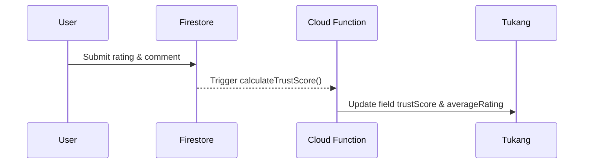
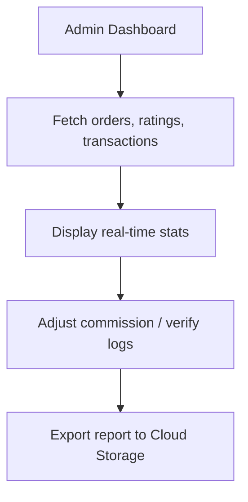

# 🔄 TukanginAja – Flow Diagram Fitur Inti (ATM Edition)

## 🎯 Purpose

Menjelaskan alur data dan interaksi antar komponen utama (User – Tukang – Admin)
agar seluruh proses berjalan real-time, aman, dan sinkron dengan sistem backend Firebase.

---

## 1️⃣ Order Flow (User → Tukang → Admin)



**Ringkasan:**
Order real-time berbasis listener Firestore, dengan Cloud Function memproses komisi otomatis.

---

## 2️⃣ Chat Flow (Realtime Firestore Channel)



**Catatan:**
Pesan hanya dapat diakses oleh pihak terkait (User & Tukang berdasarkan orderId).

---

## 3️⃣ Payment & Saldo Flow

```mermaid
flowchart TD
    A[User Top-up Saldo] --> B[Firestore: transactions/]
    B --> C[Cloud Function: validatePayment()]
    C --> D[Update Saldo User]
    D --> E[Order Complete -> Auto Transfer to Tukang]
    E --> F[Admin Commission 10%]
    F --> G[Log Transaction + Update Dashboard]
```

**Penjelasan:**
Sistem saldo internal memastikan keamanan dan transparansi transaksi.

---

## 4️⃣ Rating & Trust Score Flow



**Formula:**
```
trustScore = (avgRating * 0.7) + (completionRate * 0.3)
```

---

## 5️⃣ Admin Monitoring & Komisi Flow



**Fitur tambahan:**
- Monitoring real-time order & transaksi
- Error logs via Cloud Logging
- Export laporan otomatis ke CSV / Storage

---

## 🧠 Prinsip Implementasi Flow

1. Semua perubahan status diawasi via listener Firestore.
2. Cloud Functions memproses otomatis setiap perubahan kunci.
3. Chat & Notifikasi menggunakan FCM berbasis token.
4. Admin hanya memiliki akses monitoring (read-only).
5. Semua interaksi tercatat di Cloud Logging.

---

## 🏁 Status

✅ Flow Diagram Fitur Inti selesai dibuat.

Next Step → Implement **ATM Roadmap Teknis (Tahap 4)**.

